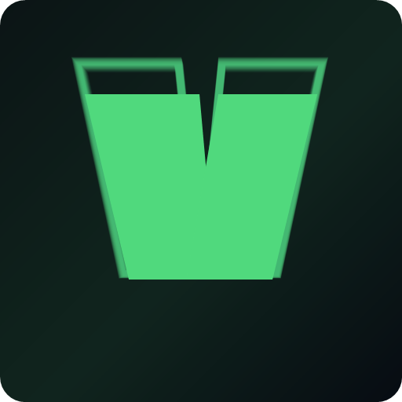

<div align="center">



# VoxelPort

**The all-in-one Minecraft server manager for friend groups and communities.**

[](#)
[](#)
[](#)
[](https://discord.gg/dYXqe6tvSN)
[](#)

Install, run, manage and share Minecraft servers — all from one clean desktop app.  
No port forwarding. No command lines. No headaches.

[**Download v1.1.0**](https://github.com/trazhub/VoxelPort/releases/latest) · [**Join Discord**](https://discord.gg/dYXqe6tvSN) · [**Report Bug**](https://github.com/trazhub/VoxelPort/issues)

</div>

---

## ✨ Features

<table>
<tr>
<td width="50%">

### 🖥️ Server Management
- Install **Paper, Fabric, Forge, Vanilla, Purpur & NeoForge**
- One-click start / stop with live console output
- RAM & Java path configuration per server
- Real-time CPU, RAM & player count stats
- Rename, remove and open server folders instantly

</td>
<td width="50%">

### 🔌 Mods & Plugins
- Browse & install mods from **Modrinth**
- Browse & install plugins from **Hangar**
- One-click mod updates with version tracking
- Installed mod list with remove support

</td>
</tr>
<tr>
<td width="50%">

### 🌐 Play Together
- Generate a shareable **6-character room code**
- Friends join with the code — **zero port forwarding**
- Built-in relay powered by `voxelportrelay.qzz.io`
- Custom relay URL support for self-hosters

</td>
<td width="50%">

### 🔐 Discord Verified
- Link your Discord account via secure **DM code**
- No passwords, no OAuth tokens — ever
- Community-gated access
- Roles detected automatically on verify

</td>
</tr>
</table>

---

## 🚀 Getting Started

### Requirements

- **Windows** 10 or later
- **Java 17+** installed (for running Minecraft servers)
- Member of the [VoxelPort Discord](https://discord.gg/dYXqe6tvSN)

### Installation

```
1. Download VoxelPort-1.1.0.exe from Releases
2. Run the installer — it sets up automatically
3. Open VoxelPort
4. Enter your Discord username
5. Check your Discord DMs for a 6-digit code
6. Enter the code → you're in ✅
```

> **First time?** Join the Discord server first: [discord.gg/dYXqe6tvSN](https://discord.gg/dYXqe6tvSN)

---

## 🎮 How It Works

### 1. Install a Server
Choose a server type, pick a Minecraft version, set RAM and install path. VoxelPort downloads and configures everything automatically — including accepting the EULA.

### 2. Run & Manage
Start your server, watch the live console, send commands, and track real-time stats (RAM, CPU, uptime, player count) from the dashboard.

### 3. Mods & Plugins
Search Modrinth or Hangar directly inside the app. Install with one click, get update notifications, and remove mods cleanly.

### 4. Share with Friends
Hit **Create Room** on any running server. Share the 6-character code. Friends open VoxelPort → **Join Room** → paste the code → connected. No router config, no IP sharing.

---

## 🔐 Discord Verification Flow

```
 Open App
    │
    ▼
 Enter Discord username
    │
    ▼
 6-digit code sent to your Discord DMs
    │
    ▼
 Enter code in the app
    │
    ▼
 Verified ✅  App unlocks
```

Must be a member of the VoxelPort Discord server to verify.  
Join here → **[discord.gg/dYXqe6tvSN](https://discord.gg/dYXqe6tvSN)**

---

## 🛠️ Development Setup

### Prerequisites

```bash
node >= 18
npm  >= 9
```

### Install & Run

```bash
git clone https://github.com/trazhub/VoxelPort.git
cd VoxelPort
npm install
npm run dev
```

### Production Build

```bash
npm run build
```

Output → `dist-electron/VoxelPort-1.1.0.exe`

---

## 🌐 Relay Server

VoxelPort ships with a hosted public relay at:

```
wss://voxelportrelay.qzz.io
```

To use your own relay, go to **Settings → Relay Server URL** and enter your WebSocket endpoint:

```
wss://your-relay-domain.com/relay
```

If only a hostname is entered, VoxelPort automatically appends `/relay`.

### Self-host the Relay

```bash
# Manual (Node.js)
cd relay-server
node index.js

# Docker
cd relay-server
docker build -t voxelport-relay .
docker run -d -p 4000:4000 voxelport-relay
```

---

## 🏗️ Built With

| Layer | Technology |
|---|---|
| Desktop shell | [Electron](https://electronjs.org) |
| UI Framework | [React 19](https://react.dev) |
| Styling | [Tailwind CSS](https://tailwindcss.com) |
| Icons | [Lucide React](https://lucide.dev) |
| Bundler | [Vite](https://vitejs.dev) |
| Installer | [electron-builder](https://www.electron.build) |
| Persistence | [electron-store](https://github.com/sindresorhus/electron-store) |
| Multiplayer | Custom WebSocket relay |

---

## 📁 Project Structure

```
src/
├── main/                    # Electron main process (Node.js)
│   ├── index.js             # App entry & lifecycle
│   ├── ipc.js               # All IPC handlers
│   ├── server.js            # Minecraft server process manager
│   ├── installer.js         # Server type downloader
│   ├── modManager.js        # Modrinth & Hangar integration
│   ├── relay.js             # WebSocket relay client
│   └── discord-verify.js   # Discord DM verification
│
├── renderer/                # React frontend
│   ├── pages/
│   │   ├── Home.jsx         # Server dashboard
│   │   ├── Install.jsx      # Server installer wizard
│   │   ├── Mods.jsx         # Mod & plugin browser
│   │   ├── CreateRoom.jsx   # Room creation
│   │   ├── JoinRoom.jsx     # Room joining
│   │   └── Settings.jsx     # App configuration
│   ├── components/
│   │   ├── DiscordGate.jsx  # Verification gate
│   │   ├── Sidebar.jsx
│   │   ├── TitleBar.jsx
│   │   └── ...
│   └── styles.css
│
└── preload.cjs              # Electron context bridge
```

---

## 🤝 Contributing

Contributions, bug reports and feature requests are welcome.

1. Fork the repo
2. Create a branch: `git checkout -b feature/your-feature`
3. Commit your changes: `git commit -m 'add your feature'`
4. Push: `git push origin feature/your-feature`
5. Open a Pull Request

---

## 📜 License

MIT © [VoxelPort](https://github.com/trazhub/VoxelPort)

---

<div align="center">

Made with ❤️ for the Minecraft community

[Discord](https://discord.gg/dYXqe6tvSN) · [Releases](https://github.com/trazhub/VoxelPort/releases) · [Sponsor](https://github.com/sponsors/trazhub)

</div>
